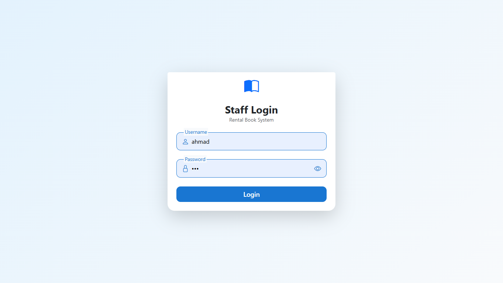
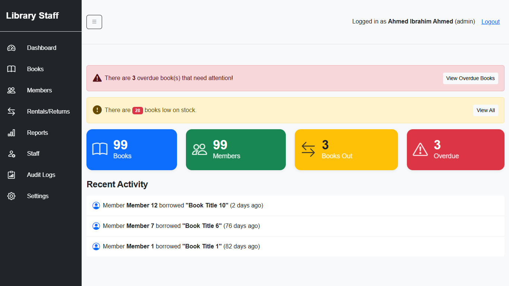
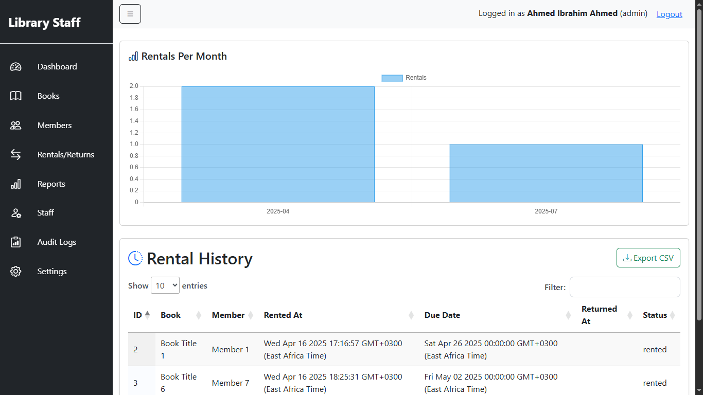
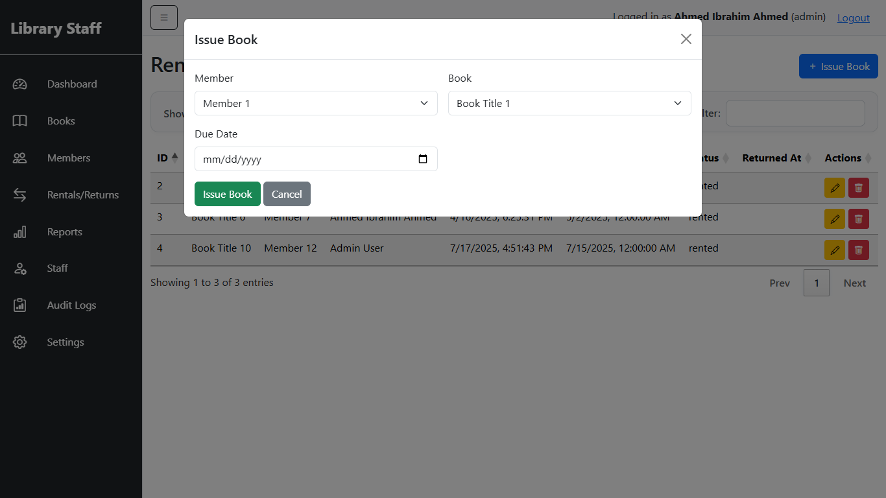
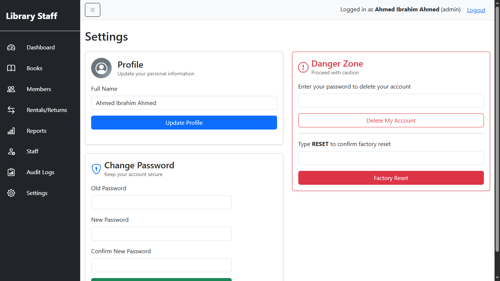

# Rental Book System

A multi-user library management system built with **Node.js**, **Express**, and **MySQL**.  
Features include staff registration, secure authentication, per-user data isolation, book and member management, rental tracking, reporting (with charts), and audit logging.  
Designed for organizations that require strict separation of user data and robust administrative controls.

---

## 🚀 Features

- **Staff Registration & Authentication**
- **Role-based Access (Admin/Librarian)**
- **Per-user Data Isolation**
- **Book, Member, and Staff Management**
- **Book Rentals & Returns**
- **Audit Logging**
- **Reports with DataTables & Charts**
- **Modern, Responsive UI**
- **Danger Zone (Account Deletion, Factory Reset)**
- **Beautiful Login & Settings Pages**

---

## 📸 Screenshots

### Login Page


### Dashboard


### Reports with Chart


### Rentals and Returns


### Settings Page


---

## 🛠️ Setup Instructions

### 1. **Clone the Repository**

```bash
git clone https://github.com/MasterWithAhmad/rental-book-system.git
cd rental-book-system
```

### 2. **Install Dependencies**

```bash
npm install
```

### 3. **Configure Environment Variables**

Create a `.env` file in the root directory:

```bash
cp .env.example .env
```

Edit `.env` and set your MySQL credentials:

```
DB_HOST=localhost
DB_USER=your_mysql_user
DB_PASSWORD=your_mysql_password
DB_NAME=library_system
SESSION_SECRET=your_secret_key
```

### 4. **Setup the Database**

- Create the database and tables:

```bash
mysql -u your_mysql_user -p < schema.sql
```

- (Optional) Seed initial data:

```bash
node seed_data.js
node seed_staff.js
```

### 5. **Run the Application**

```bash
npm start
```

The app will be available at [http://localhost:3000](http://localhost:3000)

---

## 🧑‍💻 Usage

- **Login** with the seeded admin or librarian accounts (see `seed_staff.js` for credentials).
- **Add/Edit/Delete** books, members, and rentals.
- **View Reports** with interactive tables and charts.
- **Audit Logs** are available for admins.
- **Settings** page allows profile updates, password changes, and access to the Danger Zone (account deletion, factory reset).

---

## 📊 Technologies Used

- Node.js, Express.js
- MySQL
- EJS (templating)
- Bootstrap 5, Bootstrap Icons
- DataTables.js
- Chart.js
- SweetAlert2

---

## 📁 Project Structure

```
rental-book-system/
├── app.js
├── config/
├── middleware/
├── public/
├── routes/
├── views/
├── schema.sql
├── seed_data.js
├── seed_staff.js
├── package.json
└── .env.example
```

---

## 🖼️ Adding Screenshots

Place your screenshots in the `screenshots/` directory.  
Recommended names: `login.png`, `dashboard.png`, `reports.png`, `settings.png`, `rentals-and-returns.png`.

---

## 📝 License

This project is open source and available under the [MIT License](LICENSE).

---

## 🌐 Repository

[https://github.com/MasterWithAhmad/rental-book-system](https://github.com/MasterWithAhmad/rental-book-system)

---

## 🙏 Acknowledgements

- [Bootstrap](https://getbootstrap.com/)
- [DataTables](https://datatables.net/)
- [Chart.js](https://www.chartjs.org/)
- [SweetAlert2](https://sweetalert2.github.io/)

--- 